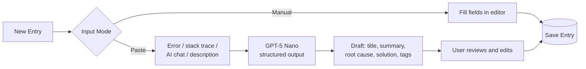
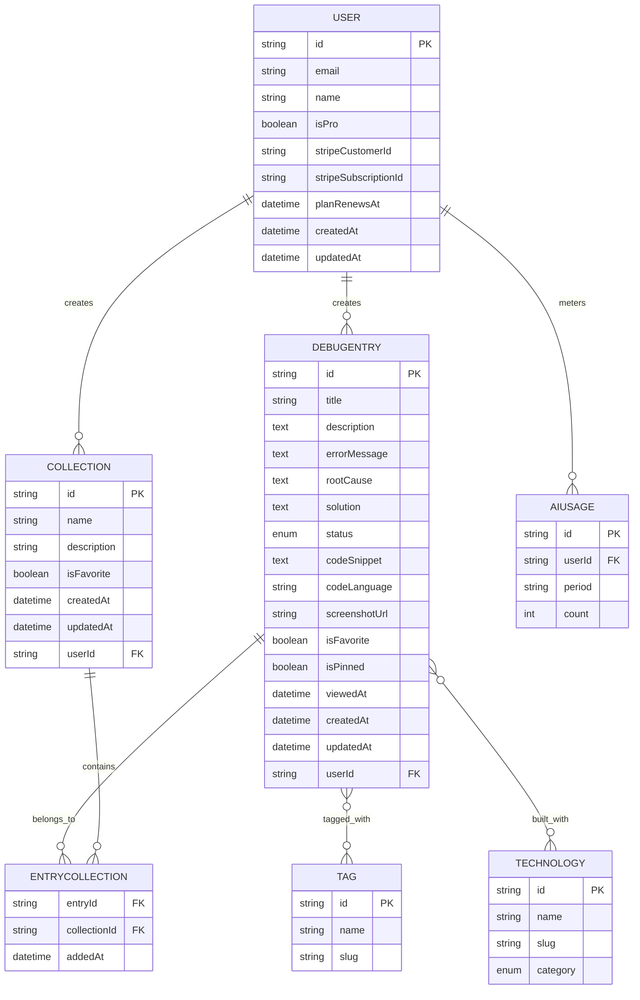
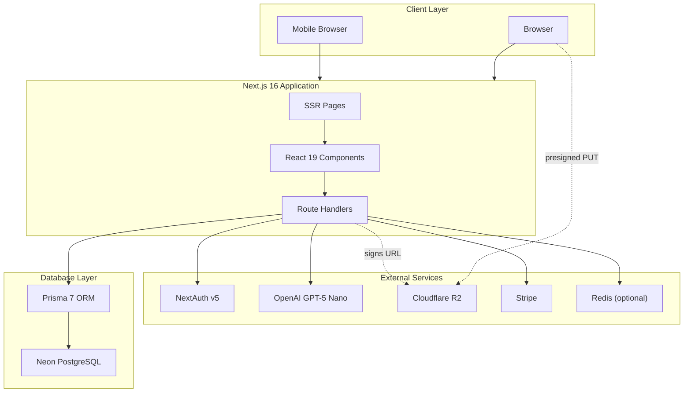
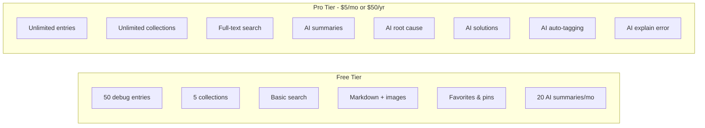

# DevDebug - Project Overview

> An AI-enhanced debugging journal. Never solve the same bug twice.

---

## 📋 Table of Contents

- [Problem Statement](#-problem-statement)
- [Target Users](#-target-users)
- [Features](#-features)
- [Data Architecture](#️-data-architecture)
- [Tech Stack](#️-tech-stack)
- [Monetization](#-monetization)
- [UI/UX Guidelines](#-uiux-guidelines)
- [Project Structure](#-project-structure)
- [Next Steps](#-next-steps)

---

## 🎯 Problem Statement

Developers solve dozens of bugs every week, but the knowledge behind those fixes is almost never preserved.

| Knowledge                | Where It Ends Up                 |
| ------------------------ | -------------------------------- |
| Root cause analysis      | ChatGPT / Claude / Gemini chats  |
| Working solutions        | Stack Overflow, GitHub issues    |
| Commands that fixed it   | Terminal history                 |
| Team debugging context   | Slack & Discord threads          |
| Investigation notes      | Temporary Notion pages, .txt     |
| Reference material       | Browser tabs never revisited     |
| The "why" behind a fix   | Thin commit messages             |
| Everything else          | Personal memory                  |

**The Result:** Developers re-investigate solved problems, lose debugging context, burn hours searching for previous fixes, and make onboarding painful for teammates.

**The Solution:** DevDebug captures every bug, its root cause, investigation, and final solution in ONE searchable knowledge base — with AI doing the write-up so capture takes seconds.

---

## 👥 Target Users

| User Type                     | Primary Needs                                             |
| ----------------------------- | --------------------------------------------------------- |
| **Software Developer**        | Personal library of bugs, root causes, and solutions      |
| **AI-First Developer**        | Save AI debugging conversations and generated solutions   |
| **Freelancer / Indie Hacker** | Searchable history across many projects                   |
| **Development Team**          | Shared cases to cut duplicate work and speed onboarding   |
| **Student / Junior Dev**      | Learn from documented mistakes, build a knowledge base    |

> **Scope note:** v1 is single-user. Every query is scoped by `userId` so team workspaces become an addition, not a rewrite.

---

## ✨ Features

### A. Debug Entries

A Debug Entry is the core unit of DevDebug — a single bug encountered and resolved.

| Field           | Required | Notes                              |
| --------------- | :------: | ---------------------------------- |
| Title           |    ✅     | Short, searchable                  |
| Description     |    ✅     | What happened, what was expected   |
| Error Message   |    ❌     | Raw error or stack trace           |
| Root Cause      |    ✅     | Why it actually broke              |
| Solution        |    ✅     | What fixed it                      |
| Technologies    |    ✅     | Colour-coded badges by category    |
| Status          |    ✅     | Open / Resolved                    |
| Tags            |    ❌     | Free-form labels                   |
| Code Snippet    |    ❌     | With language for highlighting     |
| Screenshot      |    ❌     | Uploaded to R2                     |

#### Status Types

| Status      | Icon          | Color               | Meaning                     |
| ----------- | ------------- | ------------------- | --------------------------- |
| 🟠 Open      | `CircleDot`   | `#f59e0b` (amber)   | Still under investigation   |
| 🟢 Resolved  | `CircleCheck` | `#22c55e` (green)   | Root cause found and fixed  |

#### Entry Creation Flow



> **Rule:** AI output always lands in an editable draft. Nothing is ever saved without user review.

### B. Collections

Users organize entries into collections. Entries support many-to-many relationships with collections.

**Examples:** `Spring Boot` · `React` · `Docker` · `PostgreSQL` · `Authentication` · `Production Issues`

### C. Search

Full-text search across:

- Title
- Description
- Error Message
- Root Cause
- Solution
- Technologies
- Tags

**Filters:** Status · Collection · Technology

### D. Authentication

- Email/password authentication
- GitHub OAuth sign-in
- Powered by NextAuth v5

### E. Core Features

- ⭐ Favorite debug entries
- 📌 Pin important entries to top
- 🕐 Recently viewed entries
- ✍️ Markdown editor
- 🖼️ Image upload for screenshots
- 💻 Rich code blocks with syntax highlighting
- 📋 Copy code snippet button
- 🌙 Dark mode (default)
- 🏷️ Multi-collection entry assignment

### F. AI Features

| Feature                | Free        | Pro       |
| ---------------------- | ----------- | --------- |
| 📝 AI bug summary       | 20 / month  | Unlimited |
| 🔍 AI root cause        | ❌           | ✅         |
| 💡 AI solution          | ❌           | ✅         |
| 🏷️ AI auto-tagging      | ❌           | ✅         |
| ⚡ AI explain error     | ❌           | ✅         |

---

## 🗄️ Data Architecture

### Entity Relationship Diagram



### Prisma Schema

```prisma
// prisma/schema.prisma

generator client {
  provider = "prisma-client" // Prisma 7 generator — requires an output path
  output   = "../src/generated/prisma"
}

datasource db {
  provider = "postgresql"
  url      = env("DATABASE_URL")
}

// ============================================
// ENUMS
// ============================================
enum EntryStatus {
  OPEN
  RESOLVED
}

enum TechCategory {
  FRONTEND
  BACKEND
  DATABASE
  DEVOPS
  AI
  OTHER
}

// ============================================
// USER
// ============================================
model User {
  id                   String    @id @default(cuid())
  email                String    @unique
  emailVerified        DateTime?
  name                 String?
  image                String?
  password             String? // null for OAuth-only users
  isPro                Boolean   @default(false)
  stripeCustomerId     String?   @unique
  stripeSubscriptionId String?   @unique
  planRenewsAt         DateTime? // handles cancelled-but-still-active subs
  createdAt            DateTime  @default(now())
  updatedAt            DateTime  @updatedAt

  // Relations
  entries     DebugEntry[]
  collections Collection[]
  aiUsage     AiUsage[]
  accounts    Account[]
  sessions    Session[]

  @@map("users")
}

// ============================================
// NEXTAUTH MODELS
// ============================================
model Account {
  id                String  @id @default(cuid())
  userId            String
  type              String
  provider          String
  providerAccountId String
  refresh_token     String? @db.Text
  access_token      String? @db.Text
  expires_at        Int?
  token_type        String?
  scope             String?
  id_token          String? @db.Text
  session_state     String?

  user User @relation(fields: [userId], references: [id], onDelete: Cascade)

  @@unique([provider, providerAccountId])
  @@map("accounts")
}

model Session {
  id           String   @id @default(cuid())
  sessionToken String   @unique
  userId       String
  expires      DateTime

  user User @relation(fields: [userId], references: [id], onDelete: Cascade)

  @@map("sessions")
}

model VerificationToken {
  identifier String
  token      String   @unique
  expires    DateTime

  @@unique([identifier, token])
  @@map("verification_tokens")
}

// ============================================
// DEBUG ENTRY
// ============================================
model DebugEntry {
  id            String      @id @default(cuid())
  title         String
  description   String      @db.Text
  errorMessage  String?     @db.Text // raw error or stack trace
  rootCause     String      @db.Text
  solution      String      @db.Text
  status        EntryStatus @default(OPEN)
  codeSnippet   String?     @db.Text
  codeLanguage  String? // for syntax highlighting
  screenshotUrl String? // R2 object URL
  isFavorite    Boolean     @default(false)
  isPinned      Boolean     @default(false)
  viewedAt      DateTime? // powers "Recently viewed"
  createdAt     DateTime    @default(now())
  updatedAt     DateTime    @updatedAt

  // Relations
  userId       String
  user         User         @relation(fields: [userId], references: [id], onDelete: Cascade)
  tags         Tag[]        @relation("EntryTags")
  technologies Technology[] @relation("EntryTechnologies")

  // Many-to-many with collections
  collections EntryCollection[]

  @@index([userId, createdAt(sort: Desc)])
  @@index([userId, status])
  @@index([userId, isPinned])
  @@index([userId, viewedAt(sort: Desc)])
  @@map("debug_entries")
}

// ============================================
// COLLECTION
// ============================================
model Collection {
  id          String   @id @default(cuid())
  name        String
  description String?  @db.Text
  isFavorite  Boolean  @default(false)
  createdAt   DateTime @default(now())
  updatedAt   DateTime @updatedAt

  // Relations
  userId String
  user   User   @relation(fields: [userId], references: [id], onDelete: Cascade)

  // Many-to-many with entries
  entries EntryCollection[]

  @@unique([userId, name]) // no duplicate collection names per user
  @@index([userId])
  @@map("collections")
}

// ============================================
// ENTRY-COLLECTION JOIN TABLE
// ============================================
model EntryCollection {
  entryId      String
  collectionId String
  addedAt      DateTime @default(now())

  entry      DebugEntry @relation(fields: [entryId], references: [id], onDelete: Cascade)
  collection Collection @relation(fields: [collectionId], references: [id], onDelete: Cascade)

  @@id([entryId, collectionId])
  @@index([collectionId])
  @@map("entry_collections")
}

// ============================================
// TAG
// ============================================
model Tag {
  id      String       @id @default(cuid())
  name    String // display form: "Race Condition"
  slug    String       @unique // match form: "race-condition"
  entries DebugEntry[] @relation("EntryTags")

  @@map("tags")
}

// ============================================
// TECHNOLOGY
// ============================================
model Technology {
  id       String       @id @default(cuid())
  name     String // display form: "Next.js"
  slug     String       @unique // match form: "nextjs"
  category TechCategory @default(OTHER) // drives badge colour
  entries  DebugEntry[] @relation("EntryTechnologies")

  @@map("technologies")
}

// ============================================
// AI USAGE (free tier quota metering)
// ============================================
model AiUsage {
  id     String @id @default(cuid())
  userId String
  period String // "2026-07" — one row per user per month
  count  Int    @default(0)

  user User @relation(fields: [userId], references: [id], onDelete: Cascade)

  @@unique([userId, period])
  @@map("ai_usage")
}
```

#### Schema Notes

| Decision                          | Reason                                                                          |
| --------------------------------- | ------------------------------------------------------------------------------- |
| `Technology` as its own model      | UI colour-codes badges by category — that mapping needs one home                |
| `AiUsage` counter                  | Free tier caps AI at 20/month; unenforceable without a counter                  |
| `EntryCollection` explicit join    | Gives you `addedAt` for sorting entries within a collection                     |
| `codeLanguage`, `viewedAt`         | Required by syntax highlighting and "Recently viewed"                           |
| `onDelete: Cascade` throughout     | Deleting a user must not strand rows                                            |
| `isPro` boolean                    | Fine for two tiers. Swap to a `Plan` enum if a third tier ever appears          |
| Tags are global, unique by `slug`  | Simple de-duplication. Alternative: `@@unique([userId, name])` for per-user tags |

### Seed Data for Technologies

```typescript
// prisma/seed.ts

import { PrismaClient, TechCategory } from '../src/generated/prisma';

const prisma = new PrismaClient();

const technologies = [
  // Frontend
  { name: 'React', slug: 'react', category: TechCategory.FRONTEND },
  { name: 'Next.js', slug: 'nextjs', category: TechCategory.FRONTEND },
  { name: 'TypeScript', slug: 'typescript', category: TechCategory.FRONTEND },
  { name: 'Tailwind CSS', slug: 'tailwindcss', category: TechCategory.FRONTEND },
  // Backend
  { name: 'Node.js', slug: 'nodejs', category: TechCategory.BACKEND },
  { name: 'Spring Boot', slug: 'spring-boot', category: TechCategory.BACKEND },
  { name: 'Express', slug: 'express', category: TechCategory.BACKEND },
  { name: 'Python', slug: 'python', category: TechCategory.BACKEND },
  // Database
  { name: 'PostgreSQL', slug: 'postgresql', category: TechCategory.DATABASE },
  { name: 'Prisma', slug: 'prisma', category: TechCategory.DATABASE },
  { name: 'Redis', slug: 'redis', category: TechCategory.DATABASE },
  { name: 'MongoDB', slug: 'mongodb', category: TechCategory.DATABASE },
  // DevOps
  { name: 'Docker', slug: 'docker', category: TechCategory.DEVOPS },
  { name: 'Kubernetes', slug: 'kubernetes', category: TechCategory.DEVOPS },
  { name: 'GitHub Actions', slug: 'github-actions', category: TechCategory.DEVOPS },
  { name: 'Vercel', slug: 'vercel', category: TechCategory.DEVOPS },
  // AI
  { name: 'OpenAI', slug: 'openai', category: TechCategory.AI },
  { name: 'LangChain', slug: 'langchain', category: TechCategory.AI },
];

async function main() {
  console.log('Seeding technologies...');

  for (const tech of technologies) {
    await prisma.technology.upsert({
      where: { slug: tech.slug },
      update: { name: tech.name, category: tech.category },
      create: tech,
    });
  }

  console.log(`Seeded ${technologies.length} technologies.`);
}

main()
  .catch((e) => {
    console.error(e);
    process.exit(1);
  })
  .finally(async () => {
    await prisma.$disconnect();
  });
```

> **Why `slug` is the unique key:** upserting on a compound key that contains a nullable column silently fails in Postgres, because `NULL` never equals `NULL` in a unique index. A single non-null `slug` avoids the trap entirely.

---

## 🛠️ Tech Stack

### Architecture Diagram



### Technology Choices

| Category           | Technology                  | Notes                                     |
| ------------------ | --------------------------- | ----------------------------------------- |
| **Framework**      | Next.js 16 / React 19       | App Router, RSC, route handlers, one repo |
| **Language**       | TypeScript                  | `strict: true`                            |
| **Database**       | Neon PostgreSQL             | Serverless Postgres with pooling          |
| **ORM**            | Prisma 7                    | New `prisma-client` generator             |
| **Authentication** | NextAuth v5                 | Email/password + GitHub OAuth             |
| **Validation**     | Zod                         | One schema per route, reused client-side  |
| **AI**             | OpenAI GPT-5 Nano           | Structured outputs (JSON schema)          |
| **File Storage**   | Cloudflare R2               | S3-compatible, zero egress fees           |
| **Cache**          | Redis (optional)            | Rate-limiting AI routes                   |
| **Styling**        | Tailwind CSS v4 + shadcn/ui | CSS-first config, accessible components   |
| **Payments**       | Stripe                      | Subscriptions & billing                   |

### Important Development Notes

> ⚠️ **Database Migrations**
>
> **NEVER** use `prisma db push` or directly update the database structure.
>
> Always create migrations that run in development first, then production:
>
> ```bash
> # Create migration
> npx prisma migrate dev --name <migration_name>
>
> # Apply to production
> npx prisma migrate deploy
> ```

**Implementation gotchas:**

| Area          | Gotcha                                                                                    |
| ------------- | ----------------------------------------------------------------------------------------- |
| **NextAuth**  | Credentials provider requires `session: { strategy: "jwt" }` — DB sessions won't work      |
| **Tailwind**  | v4 is CSS-first. No `tailwind.config.ts` — use `@theme` in `globals.css`                   |
| **OpenAI**    | Route handlers only. The API key must never reach the browser                              |
| **R2**        | Browser uploads direct via presigned URL. Don't proxy image bytes through Next.js          |
| **Search**    | Use a Postgres `tsvector` generated column + GIN index. `ILIKE '%x%'` dies past ~5k rows   |
| **Zod**       | One schema drives the form resolver, the route handler, and the OpenAI structured output   |

### Recommended Links

- [Next.js Documentation](https://nextjs.org/docs)
- [Prisma Documentation](https://www.prisma.io/docs)
- [NextAuth.js Documentation](https://authjs.dev)
- [Zod Documentation](https://zod.dev)
- [Tailwind CSS v4](https://tailwindcss.com/docs)
- [shadcn/ui Components](https://ui.shadcn.com)
- [Neon PostgreSQL](https://neon.com/docs)
- [Cloudflare R2](https://developers.cloudflare.com/r2)
- [OpenAI Platform](https://platform.openai.com/docs)
- [Stripe Subscriptions](https://docs.stripe.com/billing/subscriptions)

---

## 💰 Monetization

### Pricing Tiers



### Feature Comparison

| Feature                          |    Free    |    Pro    |
| -------------------------------- | :--------: | :-------: |
| Debug entries                    |     50     | Unlimited |
| Collections                      |     5      | Unlimited |
| Markdown editor                  |     ✅      |     ✅     |
| Image uploads                    |     ✅      |     ✅     |
| Favorites & pinned entries       |     ✅      |     ✅     |
| Search                           |   Basic    |   Full    |
| AI bug summaries                 | 20 / month | Unlimited |
| AI root cause                    |     ❌      |     ✅     |
| AI solutions                     |     ❌      |     ✅     |
| AI auto-tagging                  |     ❌      |     ✅     |
| AI explain error                 |     ❌      |     ✅     |

### Enforcement Rules

1. **Limits are checked server-side**, in the route handler, before the write. Client-side gating is UI polish, not security.
2. **Ship `isPro` and `AiUsage` from day one.** Wiring them up later is a one-line change; retrofitting them is not.
3. **Decide downgrade behaviour before Stripe goes live.** A Pro user with 300 entries cancels — do the extras become read-only, or hidden?

> **Development Note:** During development, all users can access all features. Pro gating will be enabled before launch.

---

## 🎨 UI/UX Guidelines

### Design Principles

- **Modern & Minimal** — developer-focused aesthetic
- **Dark Mode Default** — light mode optional
- **Clean Typography** — generous whitespace
- **Subtle Accents** — borders and shadows used sparingly
- **Syntax Highlighting** — for all code blocks
- **Desktop-First** — but fully mobile friendly

### Design References

- [Linear](https://linear.app) — modern dev aesthetic
- [GitHub](https://github.com) — familiar code presentation
- [VS Code](https://code.visualstudio.com) — dark theme and syntax colours
- [Raycast](https://raycast.com) — quick access patterns

### Screenshots

Refer to the screenshots below as a base for the dashboard UI. It does not have to be exact. Use it as a reference:

- @context/screenshots/dashboard-ui-main.png
- @context/screenshots/dashboard-ui-drawer.png

### Layout Structure

```
┌─────────────────────────────────────────────────────────────┐
│  DevDebug                              🔍   ⚙️   👤          │
├──────────────┬──────────────────────────────────────────────┤
│              │                                              │
│  MAIN        │  🔍 Search entries...                        │
│  ─────────   │  [Status ▾] [Tech ▾] [Collection ▾]          │
│  🐛 All      │  ──────────────────────────────────────────  │
│  📁 Collections │                                           │
│  ⭐ Favorites│  ┌──────────┐ ┌──────────┐ ┌──────────┐     │
│  ⚙️ Settings │  │ 🟠 Open   │ │ 🟢 Resolved│ │ 🟢 Resolved│  │
│              │  │ Hydration│ │ CORS     │ │ N+1      │     │
│  ─────────   │  │ mismatch │ │ preflight│ │ query    │     │
│  COLLECTIONS │  │ #react   │ │ #docker  │ │ #prisma  │     │
│  React       │  └──────────┘ └──────────┘ └──────────┘     │
│  Docker      │                                              │
│  Production  │  Recently Viewed                             │
│              │  ┌────────────────────────────────────────┐ │
│  ◂ collapse  │  │ 🟢 JWT expired on refresh              │ │
│              │  ├────────────────────────────────────────┤ │
│              │  │ 🟠 Docker build cache miss             │ │
│              │  └────────────────────────────────────────┘ │
└──────────────┴──────────────────────────────────────────────┘
```

Clicking an entry opens a **slide-over panel** on desktop (keeps list context) and a **full page** on mobile.

### Sidebar Navigation

| Item              | Icon               | Route          |
| ----------------- | ------------------ | -------------- |
| All Debug Entries | `Bug`              | `/entries`     |
| Collections       | `FolderOpen`       | `/collections` |
| Favorites         | `Star`             | `/favorites`   |
| Settings          | `Settings`         | `/settings`    |
| Collapse toggle   | `PanelLeftClose`   | —              |

### Technology Badge Colors

| Category     | Color               | Swatch |
| ------------ | ------------------- | :----: |
| **Frontend** | `#06b6d4` (cyan)    |   🩵    |
| **Backend**  | `#8b5cf6` (violet)  |   🟣    |
| **Database** | `#3b82f6` (blue)    |   🔵    |
| **DevOps**   | `#ef4444` (red)     |   🔴    |
| **AI**       | `#14b8a6` (teal)    |   🩵    |

### Theme Tokens (Tailwind v4)

```css
/* src/app/globals.css */

@import 'tailwindcss';

@theme {
  /* Status */
  --color-status-open: #f59e0b; /* Amber */
  --color-status-resolved: #22c55e; /* Green */

  /* Technology categories */
  --color-tech-frontend: #06b6d4; /* Cyan */
  --color-tech-backend: #8b5cf6; /* Violet */
  --color-tech-database: #3b82f6; /* Blue */
  --color-tech-devops: #ef4444; /* Red */
  --color-tech-ai: #14b8a6; /* Teal */
}
```

> Tailwind v4 is CSS-first — these live in `@theme`, not a `tailwind.config.ts` file, and are usable as `bg-status-open`, `text-tech-frontend`, etc.

### Icon & Color Mapping (Lucide React)

```typescript
// src/lib/constants/entry.ts

import { CircleDot, CircleCheck } from 'lucide-react';
import type { EntryStatus, TechCategory } from '@/generated/prisma';

export const STATUS_CONFIG = {
  OPEN: { label: 'Open', icon: CircleDot, color: '#f59e0b' },
  RESOLVED: { label: 'Resolved', icon: CircleCheck, color: '#22c55e' },
} as const satisfies Record<EntryStatus, unknown>;

export const TECH_CATEGORY_COLORS = {
  FRONTEND: '#06b6d4',
  BACKEND: '#8b5cf6',
  DATABASE: '#3b82f6',
  DEVOPS: '#ef4444',
  AI: '#14b8a6',
  OTHER: '#6b7280',
} as const satisfies Record<TechCategory, string>;
```

### Responsive Behavior

| Viewport            | Sidebar                    | Entry Detail | Layout                         |
| ------------------- | -------------------------- | ------------ | ------------------------------ |
| Desktop (≥1024px)   | Visible, collapsible       | Slide-over   | Sidebar + grid of cards        |
| Tablet (768–1023px) | Drawer (hidden by default) | Slide-over   | Full-width, 2-column grid      |
| Mobile (<768px)     | Drawer (hidden by default) | Full page    | Stacked cards, single column   |

### Micro-interactions

- **Transitions** — smooth 150–200ms easing
- **Hover States** — subtle elevation on entry cards
- **Toast Notifications** — for all CRUD actions (`sonner`)
- **Loading States** — skeleton placeholders
- **Copy Button** — on every code block
- **Expandable Code Blocks** — collapse long snippets by default
- **Drawer Animations** — slide-in for entry editing

---

## 📁 Project Structure

```
devdebug/
├── prisma/
│   ├── schema.prisma
│   ├── migrations/
│   └── seed.ts
├── src/
│   ├── app/
│   │   ├── (auth)/
│   │   │   ├── login/
│   │   │   └── register/
│   │   ├── (dashboard)/
│   │   │   ├── entries/
│   │   │   │   ├── [id]/
│   │   │   │   └── new/
│   │   │   ├── collections/
│   │   │   │   └── [id]/
│   │   │   ├── favorites/
│   │   │   └── settings/
│   │   ├── api/
│   │   │   ├── entries/
│   │   │   ├── collections/
│   │   │   ├── search/
│   │   │   ├── ai/
│   │   │   │   ├── generate/
│   │   │   │   └── explain/
│   │   │   ├── upload/
│   │   │   └── webhooks/stripe/
│   │   ├── layout.tsx
│   │   └── page.tsx
│   ├── components/
│   │   ├── ui/              # shadcn components
│   │   ├── entries/
│   │   ├── collections/
│   │   ├── layout/
│   │   └── shared/
│   ├── lib/
│   │   ├── prisma.ts
│   │   ├── auth.ts
│   │   ├── stripe.ts
│   │   ├── openai.ts
│   │   ├── r2.ts
│   │   ├── limits.ts        # free tier enforcement
│   │   ├── validations/     # zod schemas
│   │   └── constants/
│   ├── generated/prisma/    # prisma client output
│   ├── hooks/
│   ├── types/
│   └── app/globals.css
├── public/
├── .env.example
├── next.config.ts
├── tsconfig.json
└── package.json
```

---

## 🚀 Next Steps

**Phase 1 — Foundation**

1. [ ] Initialize Next.js 16 project with TypeScript
2. [ ] Set up Prisma 7 with Neon PostgreSQL
3. [ ] Create initial migration for the schema
4. [ ] Seed technologies
5. [ ] Configure NextAuth v5 (email/password + GitHub, JWT strategy)

**Phase 2 — Core CRUD**

6. [ ] Build base UI shell with shadcn/ui (sidebar, drawer, theme)
7. [ ] Implement debug entries CRUD with markdown editor
8. [ ] Add syntax-highlighted code blocks with copy button
9. [ ] Implement collections CRUD + multi-collection assignment
10. [ ] Add favorites, pins, and recently viewed

**Phase 3 — Retrieval**

11. [ ] Add Postgres full-text search (tsvector + GIN index)
12. [ ] Build filter chips (status, technology, collection)

**Phase 4 — AI**

13. [ ] Paste-to-draft generation with structured outputs
14. [ ] AI explain error
15. [ ] AI usage metering + rate limiting

**Phase 5 — Media & Polish**

16. [ ] Cloudflare R2 presigned uploads for screenshots
17. [ ] Skeletons, toasts, transitions, empty states

**Phase 6 — Monetization**

18. [ ] Stripe checkout, customer portal, webhooks
19. [ ] Enable free tier limits
20. [ ] Testing & deploy to production

> **Build order note:** Search ships before AI on purpose. The core promise is *finding* old bugs — AI makes capture cheap, but it's worthless without retrieval underneath it.

---

_Last updated: July 2026_
